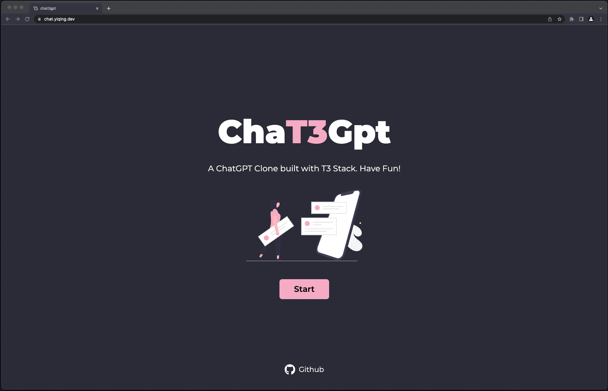

# ChaT3Gpt

A ChatGPT Clone built with <a href="https://create.t3.gg" target="_blank">T3 Stack</a>. Have Fun!

Web App: <a href="https://chat.yiqing.dev" target="_blank">https://chat.yiqing.dev</a>

Blog Post (Chinese): <a href="https://www.yiqing.dev/blogs/chat3gpt" target="_blank">https://www.yiqing.dev/blogs/chat3gpt</a>



## Tech Stack

- User Interface：React + TailwindCSS
- API Layer：tRPC
- Backend：NextJS
- Data Layer：Prisma
- Cloud Database：PlanetScale
- User Auth：Clerk
- Deploy：Vercel
- DX: TypeScript + ESLint

## Steps to run

```zsh
$ git clone git@github.com:yiqingfann/chat3gpt.git
$ cd chat3gpt
$ npm install
$ cp .env.example .env

# fill in .env with your keys

$ npm run dev

# open http://localhost:3000 in browser
```
